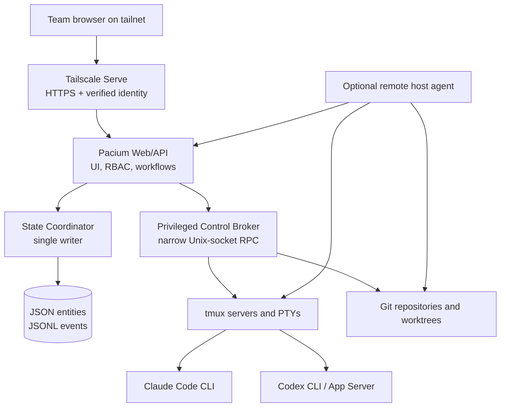
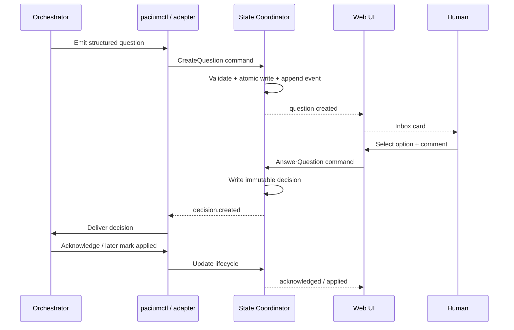
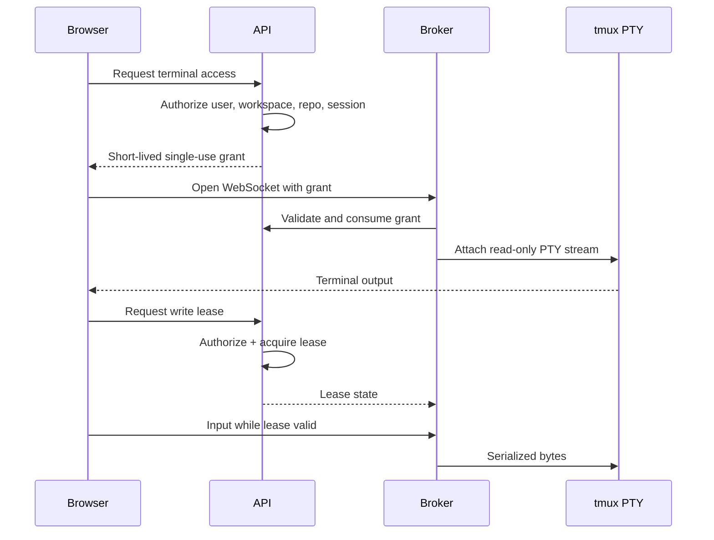

# Architecture

This document is the canonical high-level architecture. Detailed designs live under [docs/architecture](docs/architecture/README.md).

## Architectural objective

Pacium Control must provide a safe, resilient, provider-neutral control plane around CLI coding agents without replacing tmux, Git, or the agents themselves.

## System overview



## Core services

### Web application and API

Responsibilities:

- serve the product UI;
- consume verified Tailscale identity;
- enforce application authorization;
- expose typed application workflows;
- stream dashboard events;
- issue short-lived terminal connection grants;
- never hold direct access to the tmux socket.

### State coordinator

Responsibilities:

- be the only authoritative writer to central state;
- validate commands and schemas;
- allocate IDs and monotonic revisions;
- perform atomic entity writes;
- append immutable events;
- maintain in-memory indexes and projections;
- recover incomplete transactions;
- create consistent snapshots.

The state coordinator may begin in the API process, but it must remain a clear module with a single-writer invariant.

### Privileged control broker

Responsibilities:

- discover tmux servers, sessions, windows, and panes;
- operate tmux through control mode;
- attach PTYs for interactive terminal streams;
- serialize input by pane;
- manage terminal write leases;
- launch provider CLI sessions through approved templates;
- inspect Git repositories and worktrees;
- execute narrow, policy-checked host operations;
- emit observed events to the state coordinator.

The broker must run as a non-root Unix user with only the privileges required to control designated execution sessions.

### Host agent

The optional host agent enables additional laptops or servers. It initiates an outbound authenticated connection, reports host capabilities and health, and relays constrained commands to a host-local broker. It never writes central state directly.

## Systems of record

| Concern | System of record |
|---|---|
| Live process and terminal state | tmux and operating system |
| Source code, commits, branches, diffs | Git |
| Coordination entities | JSON files managed by state coordinator |
| History and audit | Append-only JSONL event streams |
| Provider-native telemetry | Claude hooks/status input and Codex App Server events |
| Human identity | Tailscale identity mapped to Pacium membership |
| Secrets | OS/provider credential stores, never Pacium state files |

## Domain model

The stable provider-neutral model includes:

- `Workspace`
- `User`
- `Membership`
- `Host`
- `Repository`
- `Run`
- `AgentSession`
- `Task`
- `PlanStep`
- `Question`
- `ApprovalRequest`
- `Decision`
- `Prompt`
- `TerminalLease`
- `Handoff`
- `ReviewBundle`
- `UsageSnapshot`
- `Event`
- `Policy`

Provider-specific data is attached through typed extensions rather than forcing every concept into a lowest-common-denominator schema.

## Data flow: human answers a question



## Data flow: terminal access



## Filesystem state shape

```text
$PACIUM_STATE_DIR/
├── meta/
│   ├── format-version.json
│   ├── revision
│   └── instance.json
├── entities/
│   ├── workspaces/<id>.json
│   ├── users/<id>.json
│   ├── memberships/<id>.json
│   ├── hosts/<id>.json
│   ├── repositories/<id>.json
│   ├── runs/<id>.json
│   ├── agents/<id>.json
│   ├── tasks/<id>.json
│   ├── questions/<id>.json
│   ├── approvals/<id>.json
│   ├── decisions/<id>.json
│   └── ...
├── events/
│   ├── global/YYYY-MM-DD.jsonl
│   └── workspaces/<workspace-id>/YYYY-MM-DD.jsonl
├── projections/
│   └── rebuildable materialized views
├── journal/
│   └── in-flight transaction manifests
├── locks/
├── snapshots/
└── quarantine/
```

Entity files are current state. JSONL files are immutable history. Projections are disposable. The journal enables deterministic recovery from interrupted multi-file mutations.

## Reliability boundaries

- Browser disconnects do not affect sessions.
- Web/API restarts do not affect tmux.
- Broker restarts trigger rediscovery, not session termination.
- State commands use idempotency keys.
- Prompt delivery is serialized per target pane.
- Terminal write control uses expiring leases.
- Every observed provider status carries confidence and freshness.
- Backups include entity state, events, policies, and manifests—but not provider secrets.

## Security boundaries

- Tailscale Serve is the normal HTTPS ingress.
- The backend binds to loopback in production.
- Source IP is never treated as human identity.
- The web process does not access tmux sockets.
- The broker exposes a narrow allowlisted protocol.
- Raw terminal is separately authorized and audited.
- Browser terminal pages load no third-party scripts.
- Provider execution identity is separate from operator identity.
- Central state contains references to credentials, never credential material.

## Deployment shape: first production version

```text
Hetzner VPS
├── tailscaled
├── tailscale serve → 127.0.0.1:<web-port>
├── pacium-web-api.service
├── pacium-broker.service
├── pacium-state directory
├── pacium tmux server
├── Claude Code CLI credentials for approved execution user
├── Codex CLI credentials for approved execution user
└── Git repositories and worktrees
```

No public web port is required. A separate, narrow break-glass administration path should exist for host recovery.

## Evolution path

The architecture begins as a modular monolith plus broker, not a distributed platform. Multi-host support adds outbound host agents without changing the core domain model. A future database is not assumed; scale pressure should first be handled through partitioned event files, snapshots, projections, and host/workspace boundaries.

Any proposal to add a database, message broker, container orchestrator, or public cloud dependency must demonstrate a concrete failure of the simpler design and record the decision in an ADR.
