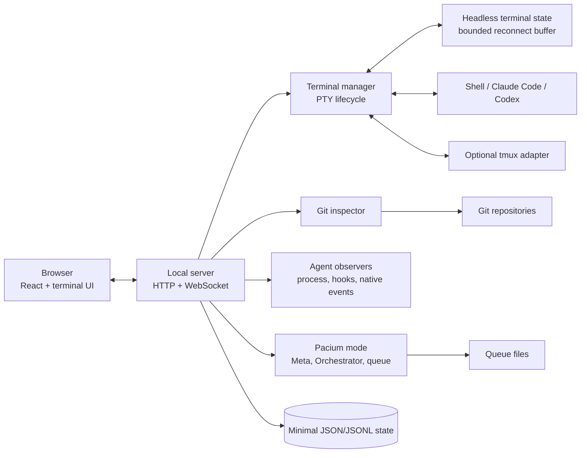

# Architecture

## Objective

Provide a fast, reliable localhost workspace for terminal sessions and CLI coding agents, then layer the Pacium Meta/Orchestrator/queue workflow onto the same shell.

## System overview



## Runtime shape

`pacium` starts one local Node.js process and opens the browser.

The local server owns:

- HTTP and WebSocket transport;
- PTY creation and lifecycle;
- terminal input/output routing;
- session registry and restoration metadata;
- Git inspection;
- agent status observation;
- Pacium-mode configuration and queue compatibility;
- minimal local filesystem state.

The browser owns:

- application navigation and selection;
- xterm rendering;
- terminal tabs and splits;
- command palette and keyboard model;
- session, Git, activity, and queue presentation;
- local view preferences.

## Terminal runtime

Direct PTYs are the default. A session has:

- immutable local ID;
- display name;
- workspace and optional repository;
- working directory;
- shell or launch preset;
- process ID and lifecycle state;
- terminal dimensions;
- bounded screen/scrollback state;
- agent classification and confidence;
- optional relaunch manifest;
- optional tmux target.

Browser connections do not own processes. A browser may disconnect and reconnect while the local server continues the PTY.

The optional tmux adapter supports:

- attaching to configured tmux sessions;
- keeping selected sessions alive across local-server restart;
- adopting sessions through explicit user action.

It is not required for the default path.

## Application transport

Shared versioned contracts cover:

- server welcome and capability report;
- session list and lifecycle updates;
- terminal attach/detach;
- terminal data and resize;
- create, rename, interrupt, relaunch, and close commands;
- repository and Git updates;
- agent attention-state updates;
- Pacium queue events and decisions;
- typed errors.

Terminal bytes use a dedicated bounded stream. Application events never masquerade as terminal bytes.

## Agent observation

Status sources are ordered by confidence:

1. provider-native event;
2. provider hook;
3. shell integration or explicit process event;
4. terminal activity inference;
5. human classification.

Each visible state records its source, observation time, and staleness. “Process running” does not automatically mean “agent working.”

## Git inspection

Git remains the source of truth for:

- repository identity;
- branch and commit;
- worktree status;
- changed files and diff;
- commits;
- configured verification output.

The initial inspector is read-mostly. Destructive Git actions and broad shell command execution are not exposed through generic remote endpoints.

## Pacium mode

Pacium mode is a configuration and presentation layer:

```text
PaciumWorkspace
├── Meta session reference or launch preset
├── Orchestrator session reference or launch preset
├── Queue source definitions
├── Optional worker session classifications
├── Repository roots
└── Verification presets
```

The first queue adapter observes existing files, tracks provenance, presents questions and approvals separately, and delivers answers through an explicit compatibility path.

## State

The current server-owned durable state is intentionally limited to two
versioned files in a configurable local data directory:

```text
pacium.json
queue-state.json
```

`pacium.json` owns only the future Pacium-mode workspace definition: explicit
role/preset bindings, repositories, worker slots, and path metadata for queue,
delivery, objective, and plan consumers. It owns no live process, terminal,
Git, provider, verification-command, or file-content truth.

`queue-state.json` owns only bounded immutable local question/approval
decisions and their single compatible delivery attempts. Schema 2 references
every attempt to an exact decision/hash, validates recomputable hashes, and
records target snapshots, payload hashes, intent time, and
delivered/failed/unknown evidence. Valid schema-1 decision-only state remains
readable and migrates atomically on the first later mutation. It contains no
queue source text, provider token, environment, terminal transcript, or
generic command.

Delivery intent is persisted before the one configured answer-file or
role-prompt side effect. The answer-file adapter creates one private
no-clobber file; the role adapter writes one fixed-shape comment line to one
exact live configured PTY. A completed or uncertain attempt is never replayed.

Writes use complete schema/reference validation, optimistic revisions, a
private same-directory temporary file, atomic rename, and directory sync.
Invalid state is preserved and degrades Pacium configuration only. Browser
tabs, splits, settings, and attention cursors remain browser-owned; terminal
history is bounded and ephemeral. Queue observation/classification caches
remain process-local and disposable. Provider credentials and complete
environment data are excluded.

## Security boundary

- Default bind address is `127.0.0.1`.
- The server rejects untrusted Origin values.
- Mutating transports require a local access token.
- WebSocket frames and terminal buffers are bounded.
- Terminal titles, hyperlinks, OSC sequences, and clipboard operations are untrusted.
- Repository paths are canonicalized against configured roots.
- The process runs with the invoking user’s privileges; no privilege escalation is introduced.

Optional remote access follows ADR-0016: Tailscale Serve terminates tailnet-only HTTPS and proxies to this same loopback process. Remote bootstrap requires an exact HTTPS Origin, verified Tailscale user identity, an explicit operator allowlist, and the existing ephemeral token.

Pacium remains on the same host as the PTYs and files it controls. Multi-user roles, another ingress mechanism, cross-host aggregation, or a separate privilege broker require a future ADR.

## Failure behavior

- Browser refresh: PTYs continue; client reconnects and restores bounded screen state.
- Browser crash: PTYs continue.
- Local-server crash: direct PTYs end; optional tmux-backed sessions may survive.
- WebSocket interruption: terminal input stops; reconnect never replays unacknowledged input automatically.
- Git inspection failure: terminal continues and the inspector shows a bounded error.
- Queue parse failure: original files remain untouched and the item is shown as invalid or conflicted.
- Corrupt Pacium configuration: preserve the last valid file where practical and fail visibly.
