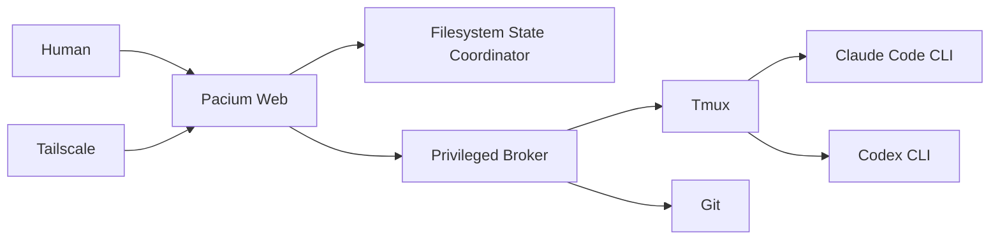

# Executive brief

## One sentence

Pacium Control is a tailnet-only web console for operating Claude Code and Codex CLI agents running in tmux, with structured human decisions, safe terminal control, Git-isolated parallel work, and evidence-backed review.

## The problem

The underlying coding agents are capable, but the operating environment is not. Work is distributed across terminal panes, session names, queue files, branches, and private context. The operator must continually reconstruct:

- which agents are alive;
- what each agent is doing;
- which repository and worktree it owns;
- what is blocked;
- what needs a human decision;
- what has changed;
- what has been tested;
- what can be safely stopped or redirected.

This reconstruction is slow, mentally expensive, and error-prone. It prevents a team from scaling the number of simultaneous agents it can trust.

## The solution

Pacium Control introduces a control plane without replacing the existing tools.

It provides:

- a Linear-inspired workspace organized by Inbox, active runs, repositories, agents, review, usage, and activity;
- structured questions and approvals with one-keystroke decisions;
- a closed loop from decision to acknowledgement to application;
- live agent and plan state from tmux and provider adapters;
- one branch and worktree per coding worker;
- evidence-backed summaries, reviews, and completion;
- secure tailnet access for the whole team;
- a full terminal drawer for low-level intervention;
- filesystem-native state with no application database.

## Why now

CLI coding agents can already execute meaningful software work, but the interface around multi-agent operation remains primitive. The immediate opportunity is not another model wrapper. It is the operational layer that makes existing tools safe and comprehensible at team scale.

## Product boundary

Pacium Control is deliberately not:

- a model provider;
- a new autonomous-agent framework;
- a replacement for Claude Code or Codex;
- a replacement for Git or tmux;
- a public SaaS dependency;
- a browser IDE;
- a shared personal-account credential proxy.

## Architecture in one view



The browser and API do not directly control tmux. A narrow broker does. Central coordination state is stored as atomic JSON entities plus append-only JSONL events. tmux and Git remain authoritative for live sessions and source history.

## The decisive workflow

```text
Orchestrator creates question
→ Meta optionally enriches it
→ Pacium Inbox assigns it
→ Human answers
→ Decision is recorded immutably
→ Orchestrator acknowledges
→ Work resumes
→ Application evidence is linked
```

This workflow is the first vertical slice and the product’s most important interaction.

## Initial success criteria

The first useful release succeeds when:

- the operator can discover and understand existing sessions from the web;
- a blocking question can be answered without SSH;
- the answer is delivered exactly once and acknowledged;
- work resumes without manual queue-file editing;
- the run page links progress to Git and verification evidence;
- browser, API, or broker restarts do not terminate tmux sessions;
- access is limited by verified Tailscale identity and application role.

## Current repository state

This repository is the complete planning foundation. It contains no product code. Implementation agents should treat the decisions, acceptance criteria, and quality gates here as the contract for building the real system.
