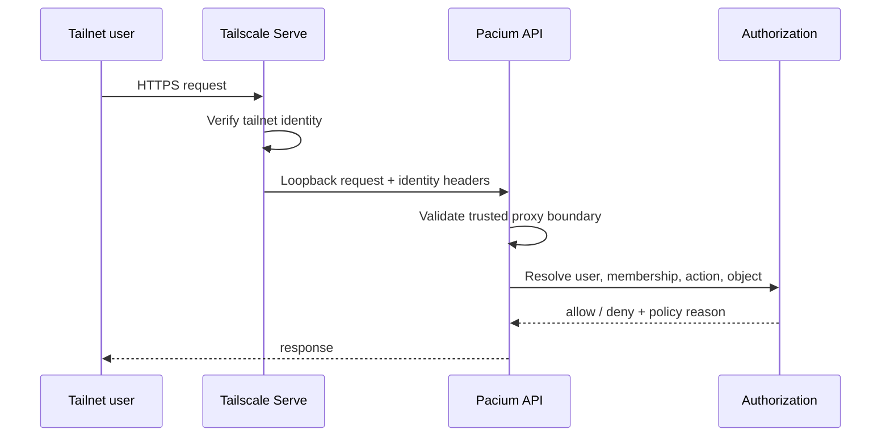

# Identity and authorization

## Identity model

A person may use multiple Tailscale devices, each with a distinct node identity and address. Pacium maps the verified Tailscale user subject/login to one Pacium `User`. Device information is context, not the human primary key.

## Request path



Production must reject requests that bypass the trusted local ingress assumptions.

## User lifecycle

- discovered external identity does not automatically receive access;
- owner creates or approves membership;
- membership may be active, suspended, or revoked;
- revocation invalidates application sessions, terminal grants, and leases;
- identity changes are audited;
- departed users retain historical attribution.

## Authorization dimensions

An authorization decision may consider:

- user;
- workspace membership;
- role;
- repository scope;
- host scope;
- run ownership;
- object classification;
- requested action;
- current object state;
- terminal lease;
- approval policy;
- workspace pause;
- execution identity availability.

## Roles

### Viewer

- read allowed structured state;
- observe permitted sessions where policy allows;
- view redacted evidence;
- no prompt delivery or terminal write.

### Operator

- viewer capabilities;
- send structured prompts to allowed sessions;
- start/pause/resume allowed runs;
- request and hold terminal control where separately permitted;
- no access-management or broad approval authority.

### Approver

- operator capabilities as configured;
- answer assigned questions;
- resolve allowed approval classes;
- create narrow run-scoped approval policy when explicitly permitted.

### Owner

- manage membership and policy;
- high-risk terminal and destructive operations;
- host/repository configuration;
- emergency controls;
- security and retention settings.

The implementation may split roles further, but should not make all tailnet members operators by default.

## Repository and host scope

A workspace role can be narrowed:

```text
User: Alice
Workspace role: Operator
Repositories: web, checkout-api
Hosts: pacium-vps
Terminal write: checkout-api only
Approval classes: none
```

Deny by default when scope is absent.

## Application sessions

- secure, HTTP-only cookies;
- short idle and absolute lifetimes appropriate to risk;
- revalidation of membership for sensitive actions;
- CSRF protection for state-changing HTTP requests;
- no long-lived bearer token in browser storage;
- clear logout and session revocation.

## Terminal grants

A terminal WebSocket grant is:

- short-lived;
- single-use;
- bound to user, session/pane, access mode, and origin;
- invalidated on role/membership change;
- separate from the terminal write lease.

## Approval policy

Policies are explicit objects with:

- scope;
- action matcher;
- maximum risk;
- host/repository/worktree limits;
- duration;
- creator and approver;
- revision;
- reason;
- audit history.

An agent cannot grant or broaden its own policy.

## Development mode

Development authentication must be clearly separate and impossible to enable accidentally in production. Suggested safeguards:

- explicit environment mode;
- loopback-only binding;
- startup banner;
- refusal when Tailscale production mode and dev identity are mixed;
- no default admin in production;
- automated configuration test.
