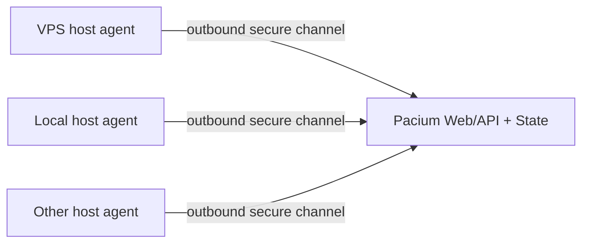

# Multi-host model

## Goal

Pacium should eventually control sessions on the primary Hetzner VPS, Felix’s local machine, and additional execution hosts without making any laptop part of the critical path for the rest of the team.

## Design

Each additional host runs:

- a host agent that initiates an outbound authenticated connection;
- a host-local broker with access to designated tmux servers and repository roots.

The central service remains the sole writer of coordination state.

## Why outbound

- avoids exposing host-agent listening ports;
- works through tailnet policy and local firewalls;
- centralizes enrollment and revocation;
- makes laptops optional rather than infrastructure dependencies.

## Enrollment

1. Owner creates a one-time enrollment grant with expected workspace and host name.
2. Host agent generates or uses a local key pair.
3. Host connects over the tailnet and presents the grant.
4. Central service records host identity and public key.
5. Owner verifies host details and activates it.
6. Grant is consumed and cannot be reused.

Enrollment and key rotation are audited.

## Host capability report

A host reports:

- OS and architecture;
- agent/broker version;
- tmux version and servers;
- Git version;
- installed provider CLIs and versions;
- configured repository roots;
- available launch profiles;
- optional CPU/memory/disk/resource data;
- current time offset/health;
- last successful backup or diagnostics where local.

Capabilities are descriptive, not automatically authorized.

## Command routing

Central API authorizes an operation, records intent, and sends a typed command to the host agent. The host-local broker validates the command against local policy and executes it.

A command includes:

- command and idempotency IDs;
- target host/resource;
- deadline;
- actor and authorization proof/reference;
- operation payload;
- expected object/session identity;
- correlation ID.

The host returns accepted, running, completed, failed, expired, or unknown. Reconnect logic deduplicates by command ID.

## Event delivery

Remote hosts send observations with a source sequence number. Central state assigns committed revisions. The host retains a bounded resend queue until events are acknowledged.

Events may arrive late. UI shows both occurrence and receipt time where relevant.

## Disconnect behavior

When a host disconnects:

- its tmux sessions are presumed to continue unless evidence says otherwise;
- central state marks host and sessions disconnected with last-known state;
- no new commands are accepted for execution;
- queued commands expire rather than replaying blindly after long delay;
- Inbox may receive an incident if policy requires;
- reconnection triggers discovery and reconciliation.

## Reconciliation

On reconnect:

1. Host reports current tmux sessions and provider processes.
2. Central compares stable session metadata and manifests.
3. Known sessions are reattached.
4. Missing sessions are marked ended or unknown after policy.
5. New sessions are classified or quarantined.
6. Commands with uncertain outcome are surfaced for review.
7. Event sequence gaps are requested.

Do not infer that a command failed solely because the connection dropped.

## Local terminal integration

The initial local-machine feature can be a copyable attach command. A future lightweight helper may register a `pacium://` scheme, but it is optional and should not become a desktop application dependency for Claude or Codex.

## Placement

Later, Pacium may suggest a host based on:

- repository availability;
- provider credentials;
- CPU/memory/disk;
- current agent load;
- security classification;
- user proximity;
- provider capacity;
- required tools.

Placement remains policy-driven and explainable. The first version need not be an automatic scheduler.
