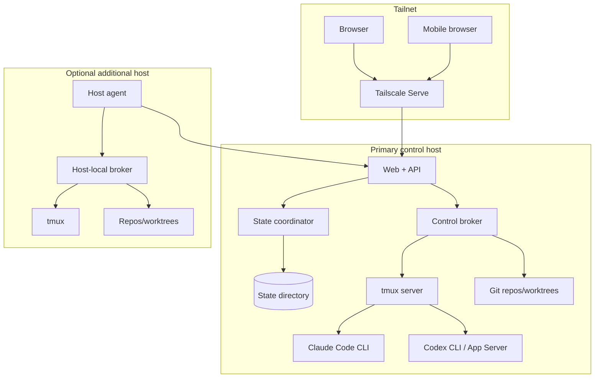

# System overview

## Architectural style

The first production system is a **modular monolith plus privileged broker**.

This shape preserves clear boundaries without paying the operational cost of microservices. The web/API and state coordinator may share a process initially, but the state module exposes a command interface and remains the sole writer. The broker is a separate process because it holds materially greater host privileges.

## Components



## Web and API module boundaries

Suggested internal modules:

- identity;
- authorization;
- workspaces;
- repositories;
- runs and tasks;
- agents and sessions;
- questions, approvals, and decisions;
- prompts;
- terminal grants and leases;
- Git evidence;
- provider usage;
- activity and summaries;
- policies;
- hosts;
- state coordinator client;
- broker client;
- streaming subscriptions.

Modules interact through typed services or commands, not direct filesystem access.

## State coordinator boundary

The state coordinator accepts commands such as:

```text
CreateRun
UpdateRun
RegisterObservedSession
CreateQuestion
AnswerQuestion
AcknowledgeDecision
CreateApprovalRequest
ResolveApproval
QueuePrompt
UpdatePromptDelivery
AcquireTerminalLease
AppendObservedEvent
CreateSnapshot
```

Each command includes:

- command ID;
- idempotency key;
- actor identity;
- authorization context;
- expected entity revision where needed;
- timestamp assigned or validated by the server;
- typed payload.

The coordinator returns either a committed result with revision/event IDs or a typed failure.

## Broker boundary

The broker exposes a small set of operations, for example:

- enumerate configured tmux servers;
- list sessions/windows/panes;
- watch control-mode notifications;
- read bounded pane history;
- attach/detach PTY stream;
- resize PTY;
- write bytes under valid lease;
- deliver a structured prompt;
- interrupt or signal a process;
- start a session from an approved launch profile;
- stop or archive a session;
- inspect Git status/diff/commits;
- create or remove a worktree under policy;
- run configured verification commands;
- report host/provider versions.

There is no generic unaudited `exec(command: string)` operation in the web-facing contract.

## Streaming model

Most application state flows server-to-browser and can use server-sent events or an equivalent resumable stream. Interactive terminal transport uses WebSockets because it is bidirectional and latency-sensitive.

Every event stream should support:

- authenticated subscription;
- authorization filters;
- monotonic cursor;
- reconnect from cursor;
- explicit resync when retention has elapsed;
- backpressure or coalescing for high-volume signals;
- separation of durable domain events from ephemeral telemetry.

## Data ownership

The API owns product behavior, not low-level host truth. The broker owns observations and operations, not durable coordination decisions. The state coordinator owns persistence, not authorization policy interpretation in isolation. These distinctions should remain visible in code.

## Deployment philosophy

Run as few moving pieces as possible:

- one web/API service;
- one broker per execution identity or controlled tmux domain;
- one primary state directory;
- optional host agents;
- systemd supervision;
- Tailscale Serve;
- ordinary encrypted backups.

Introduce more components only after measuring a real limit.
