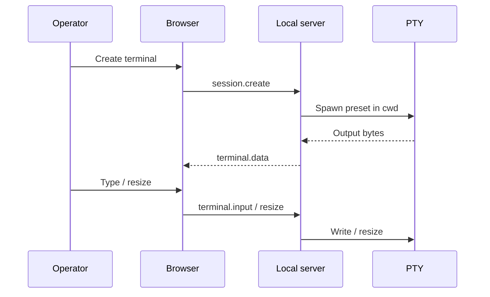
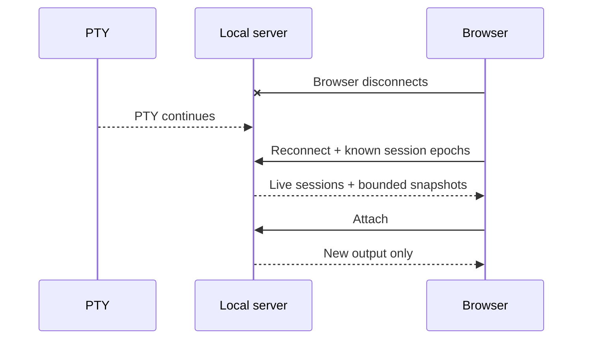

# System overview

## Components

### Browser application

- React application shell;
- xterm terminal rendering;
- sessions sidebar, tabs, and splits;
- contextual inspector;
- command palette and keyboard model;
- Git, activity, and Pacium queue presentation.

### Local server

- loopback HTTP and WebSocket server;
- terminal session registry;
- PTY runtime;
- bounded headless terminal state;
- Git inspector;
- agent observers;
- Pacium queue adapter;
- minimal state store.

### External systems

- shell and operating-system processes;
- Claude Code and Codex CLI/runtime interfaces;
- Git repositories;
- optional tmux;
- existing Pacium queue files.

## Startup

1. `pacium` validates loopback configuration and local data directory.
2. Local server starts runtime services.
3. Browser opens with a local access token delivered through the approved launch path.
4. Browser performs a versioned capability handshake.
5. Server reports live sessions and bounded restoration state.
6. Browser restores workspace layout.

## Terminal flow

## Reconnect flow

## Process boundaries

There is one local application process initially. A separate broker is not used. The local server has the same operating-system authority as the invoking user and must remain loopback-only.

Remote access changes this boundary and requires a new ADR.
