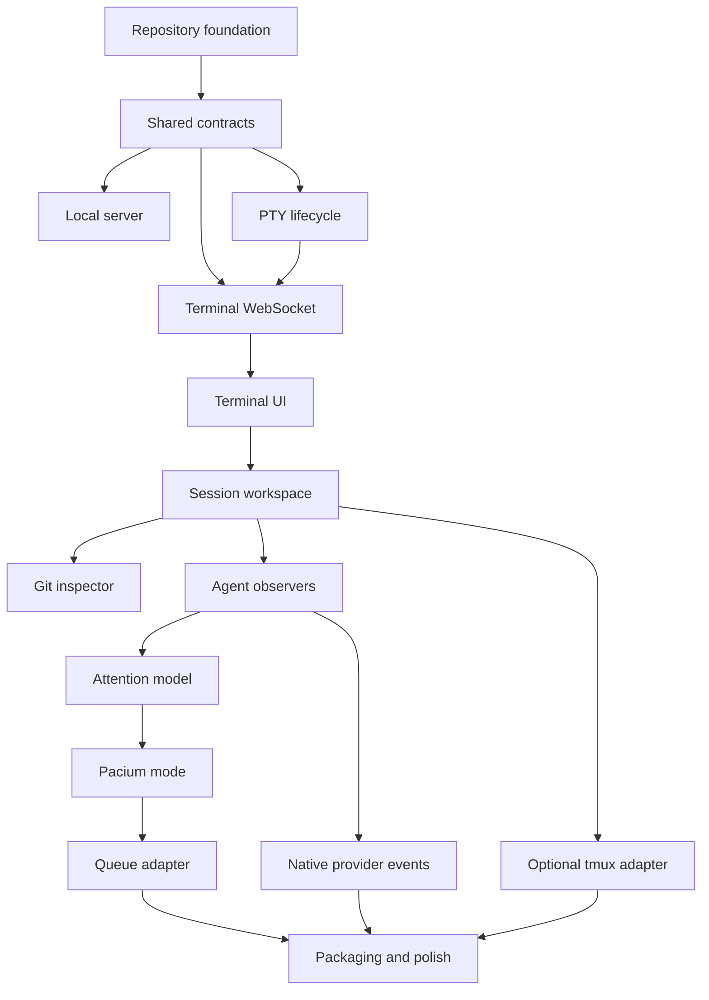

# Workstream map

## Dependency graph



## Workstreams

### WS-01 Repository and developer experience

Owns toolchain, packages, commands, CI, fixtures, generated-artifact policy, and packaging.

### WS-02 Contracts and local transport

Owns session types, WebSocket envelopes, terminal stream framing, capability negotiation, typed errors, and protocol fixtures.

### WS-03 PTY runtime

Owns PTY creation, process groups, environment policy, input, resize, signals, buffering, exit, cleanup, and relaunch manifests.

### WS-04 Terminal product UI

Owns xterm integration, layout, sessions sidebar, tabs, splits, focus, keyboard model, command palette, themes, and accessibility.

### WS-05 Agent visibility

Owns agent classification, status source/confidence/freshness, attention states, unread behavior, notifications, and activity summaries.

### WS-06 Git inspection

Owns repository detection, branch/status, changed files, diff, commits, verification presets, and bounded command output.

### WS-07 Pacium mode

Owns the toggle, Meta and Orchestrator configuration, target selection, worker summary, objective/plan context, and decision presentation.

### WS-08 Queue compatibility

Owns file watching, parsing, provenance, deduplication, question/approval separation, answer delivery, acknowledgement, and conflict handling.

### WS-09 Provider enrichment

Owns Claude and Codex runtime events, capability/version detection, clean activity cards, and fallback behavior.

### WS-10 Durability and release

Owns optional tmux attachment, reconnection, soak tests, diagnostics, packaging, clean installation, and release evidence.

## Interface ownership

| Interface               | Primary owner | Required reviewers              |
| ----------------------- | ------------- | ------------------------------- |
| Session contract        | WS-02         | WS-03, WS-04, WS-05             |
| Terminal stream         | WS-02         | WS-03, WS-04, security          |
| PTY lifecycle           | WS-03         | WS-02, security                 |
| Focus and shortcuts     | WS-04         | accessibility, terminal runtime |
| Attention vocabulary    | WS-05         | WS-04, provider owners          |
| Git inspector API       | WS-06         | WS-02, security                 |
| Pacium configuration    | WS-07         | WS-02, WS-08                    |
| Queue lifecycle         | WS-08         | WS-07, security                 |
| Provider event contract | WS-09         | WS-02, WS-05                    |
| tmux capability         | WS-10         | WS-03, WS-04                    |

## Critical path

```text
Repository → contracts → PTY → terminal transport → terminal UI
→ session workspace → attention and Git → Pacium mode → queue loop
→ native provider enrichment → optional tmux and packaging
```
