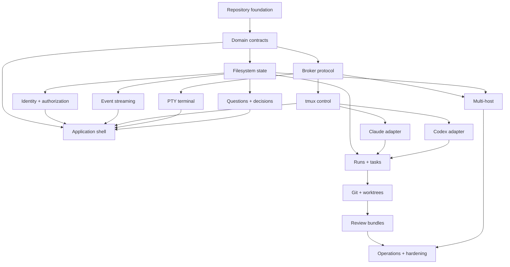

# Workstream map

## Dependency graph



## Workstream ownership

### WS-01 Repository and developer experience

Owns monorepo, toolchain, local startup, CI, fixtures, release scripts, and repository hygiene.

### WS-02 Domain contracts

Owns IDs, schemas, state machines, command/event envelopes, versioning, and canonical vocabulary.

### WS-03 Filesystem state

Owns single-writer coordinator, atomic writes, journal, indexes, snapshots, backup/restore, and integrity tooling.

### WS-04 Identity and authorization

Owns Tailscale identity mapping, sessions, memberships, roles, object policy, terminal grants, and revocation.

### WS-05 Broker and host operations

Owns RPC contract, Unix socket, tmux, PTY, approved Git/process actions, and privilege separation.

### WS-06 Web application and design system

Owns shell, navigation, lists, inspectors, command palette, responsive behavior, and accessibility.

### WS-07 Pacium workflow

Owns runs, tasks, plans, questions, approvals, decisions, prompts, Inbox, and activity.

### WS-08 Git and review

Owns worktrees, branches, evidence, verification, integration, review bundles, and optional GitHub integration.

### WS-09 Claude adapter

Owns CLI launch, hooks, status ingestion, permission bridge, capability/version handling, and fallback.

### WS-10 Codex adapter

Owns CLI/App Server, turns, plans, messages, approvals, usage, capability/version handling, and fallback.

### WS-11 Multi-host

Owns enrollment, outbound channel, remote command/event semantics, reconciliation, and local-host integration.

### WS-12 Operations and security

Owns deployment, service isolation, logging, diagnostics, backups, incidents, audits, and release readiness.

## Interface ownership

| Interface | Primary owner | Required reviewers |
|---|---|---|
| Domain schema | WS-02 | affected workstreams, security for sensitive fields |
| State command API | WS-03 | WS-02, consumers |
| Broker protocol | WS-05 | WS-02, WS-04, security |
| Browser event stream | WS-07 | WS-03, WS-06 |
| Terminal grant/lease | WS-04 | WS-05, WS-06, security |
| Provider adapter contract | WS-02 | WS-09, WS-10, WS-07 |
| Worktree contract | WS-08 | WS-05, WS-07 |
| Host protocol | WS-11 | WS-03, WS-04, WS-05, security |

## Integration rule

The owner of an interface publishes fixtures and contract tests before or with the first consumer. Consumers do not fork private variants of shared contracts.

## Critical path

```text
Repository → contracts → state → broker/tmux → auth → terminal/UI
→ questions/decisions → runs/tasks → Git/review → provider depth → multi-host
```

Provider fixture research and UI prototyping can run in parallel, but they should not redefine the critical-path contracts independently.
